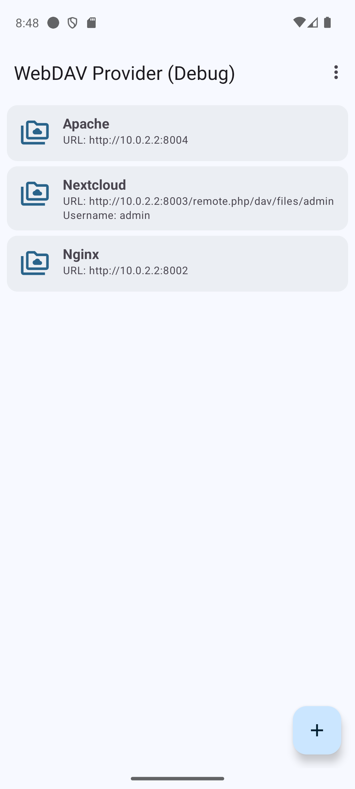
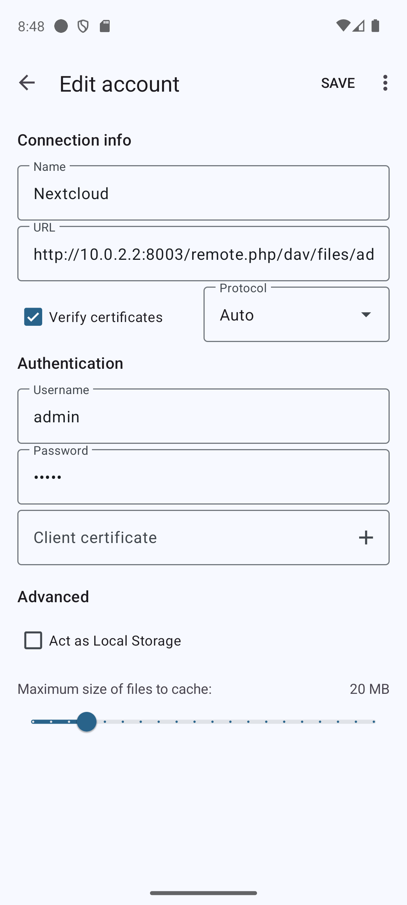
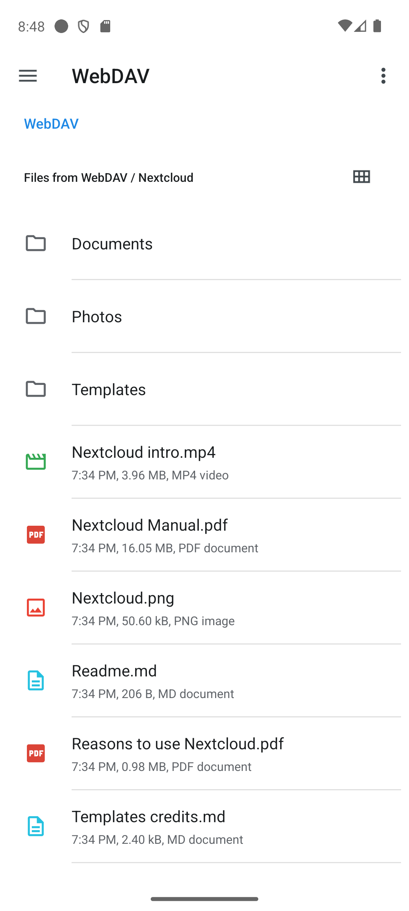
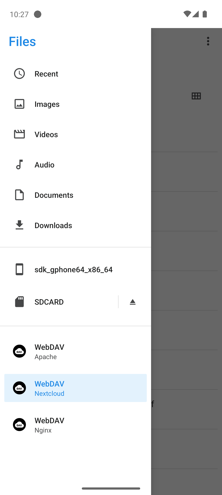

# WebDAV Provider [](https://github.com/alexbakker/webdav-provider/actions?query=workflow%3Abuild)

__WebDAV Provider__ is an Android app that can expose WebDAV storage to other
apps through Android's Storage Access Framework (SAF).

## Screenshots

[](screenshots/screenshot1.png) [](screenshots/screenshot2.png) [](screenshots/screenshot3.png) [](screenshots/screenshot4.png)

## Development

This project is automatically tested against a variety of different WebDAV servers. The tests run in an Android emulator and connect to the WebDAV servers running in separate containers on the host machine. 

To spin up the test environment:

```sh
docker compose --project-directory tests up -d --wait --force-recreate --build --renew-anon-volumes --remove-orphans
```

Assuming an Android emulator is running, use the following command to run the tests:

```sh
./gradlew connectedCheck
```

To shut the test environment down:

```sh
docker compose --project-directory tests down -v
```
